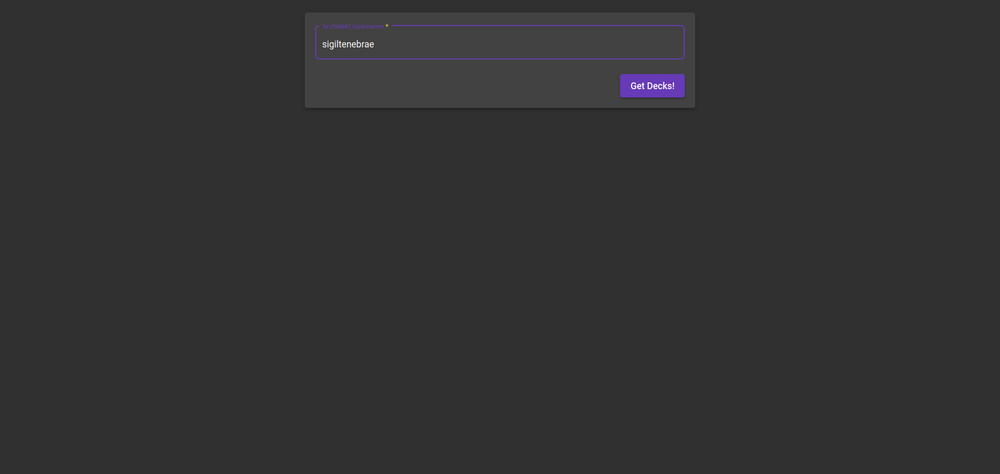
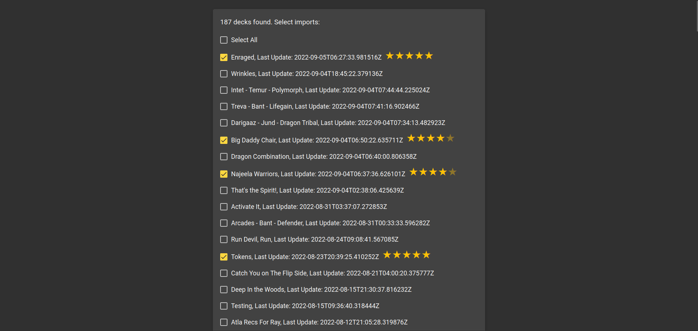
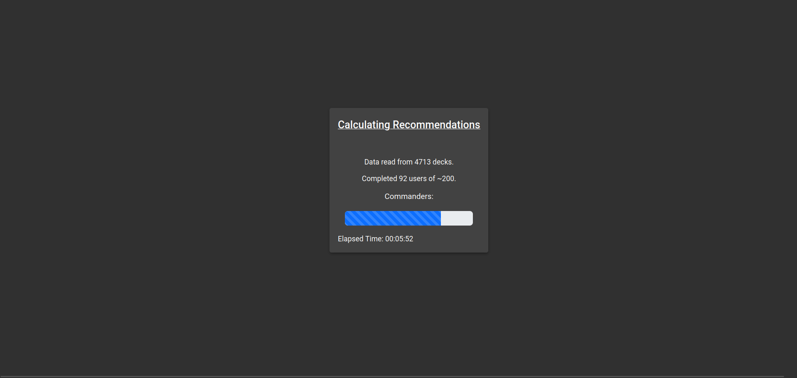
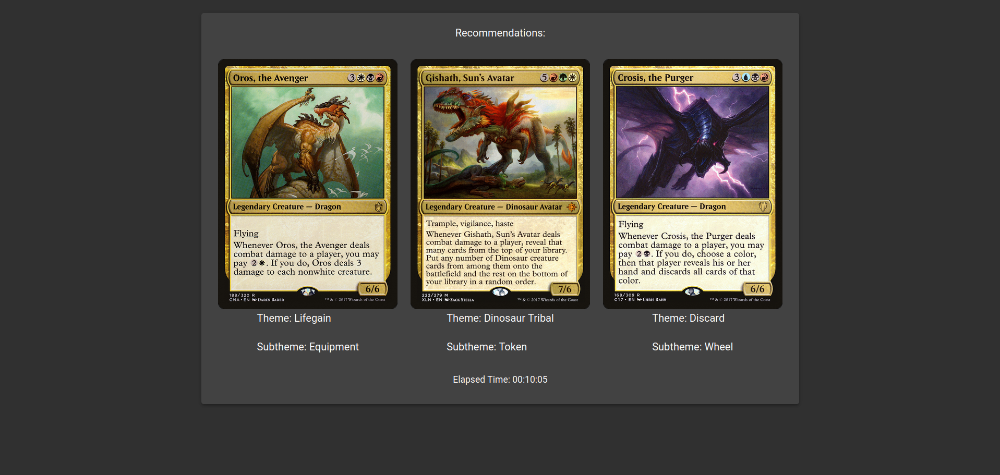

# CommanderRecs

This is a barebones version of the recommendation system used by my CommanderDash app. No DB Required!

Enter your archidekt username, select the relevant decks, rate them by how much you like them, and off you go!

Full project: https://github.com/sigiltenebrae/CommanderDash3

Instructions: 
- Install Node >= v18.8.0 and Angular >= 14.1.3
- Download source
- Run 'npm install' from source root
- Run 'npm start' to start the angular instance
- Navigate to http://localhost:4200
